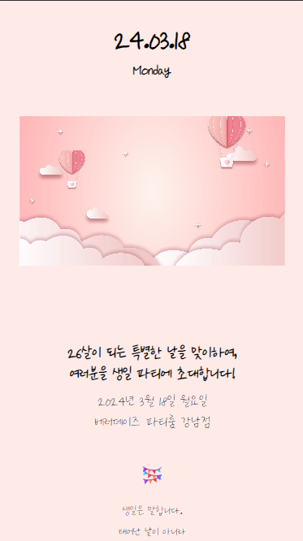
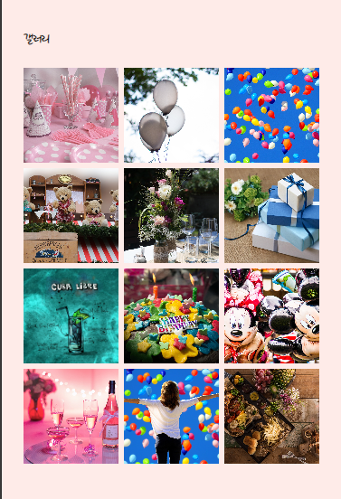
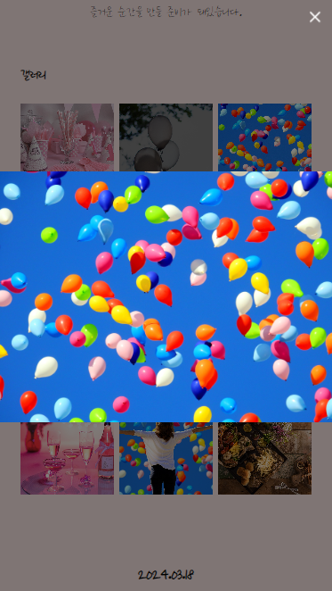
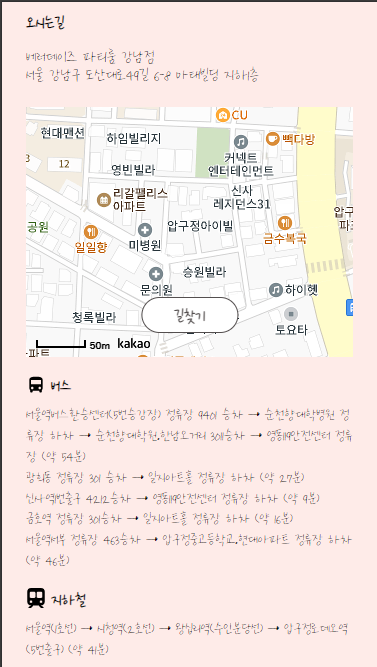
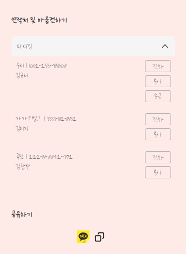

## 나만의 초대장 만들기
### 프로젝트 환경 구성
- React + TypeScript
- ESLint + Prettier
- SCSS
- Yarn Berry(pnp)
- react query v3

### UI와 기능
- 첫화면 
  
사용자는 사이트접속시 intro영상을 볼수있다. 

-갤러리 
전체 
 
이미지뷰어 
 
사용자는 초대장 갤러리를 볼수있으며 이미지를 클릭하면 이미지뷰어가 오픈된다. 
이미지뷰어는 좌우로 스와이프하면 다음/이전 이미지로 넘어간다. 
오른쪽상단의 버튼을 클릭하면 이미지뷰어가 닫힌다. 

-캘린더 
 
파티 날짜를 캘린더를 통해 확인할수있다. 

-지도 
 
장소를 카카오 맵으로 확인할수있다. 
길찾기 클릭시 새창을 통해 길찾기사이트가 나온다. 

-연락, 송금 및 공유 
 
-연락 
사용자는 전화 버튼을 누를시 등록된 번호를 통해 전화를 할수있다. 
복사버튼을 누르면 계좌와 이름이 복사된다. 
송금버튼을 누를시 카카오송금이 가능하다. 
-공유 
카카오아이콘 선택 시 초대장을 카카오메시지로 공유할수있다. 
복사이모티콘클릭시 초대장 주소가 복사된다. 

